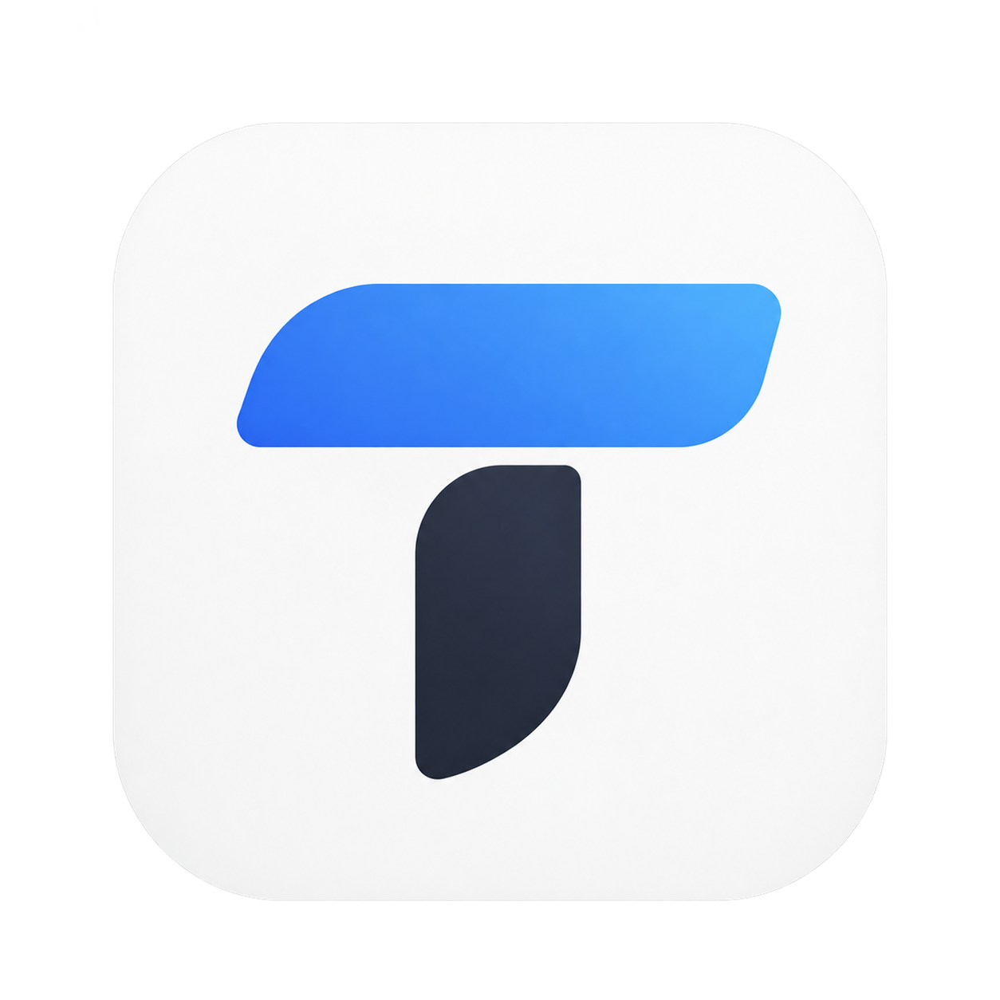

<div align="center">
  

  <h1>joki-tuton</h1>

  <p>
    <b>Pipeline otomatis mengerjakan soal tutorial online Universitas Terbuka</b><br/>
    dari scrape Moodle sampai dokumen jawaban <code>.docx</code> — lengkap
    dengan dashboard web real-time.
  </p>

  <p>
    
    
    
    
  </p>
</div>

---

Setiap sesi: ambil soal dari Moodle, tulis jawaban dengan agent AI, ambil
bahan ajar resmi sebagai referensi pertama, format persamaan jadi persamaan
Word asli, lalu rapikan Daftar Pustaka (penulis **tebal**, judul *miring*,
hanging indent).

## Pembaruan Terbaru

- **Grafik nilai di Dashboard** — kurva nilai per mata kuliah dari Diskusi &
  Tugas, digabung jadi satu garis mulus per course, dengan tab filter,
  legend interaktif, dan tooltip (jenis + sesi).
- **Browser mata kuliah + kalender jadwal** — klik baris mata kuliah untuk
  melihat chip sesi (jumlah soal) dan kalender bar `mulai → tenggat` tiap
  Diskusi/Tugas, lengkap dengan garis tenggat, weekend, navigasi bulan, dan
  tautan ke aktivitas Moodle.
- **Urutan menu dirapikan** — Dashboard → Courses → Kerjakan Tugas → Agent
  Worker → Result → Log Live → Pengaturan.
- **Ikon situs** — ikon tab browser dan `apple-touch-icon` untuk iPhone
  *Add to Home Screen* (full-bleed opaque, tanpa cincin putih di balik mask
  iOS).
- **Sesi login yang benar** — checkbox **ingat saya** (default aktif),
  modal konfirmasi sebelum keluar, logout benar-benar menghapus cookie dan
  kembali ke halaman masuk, plus guard rute: belum login tidak bisa membuka
  halaman aplikasi, sudah login tidak bisa melihat halaman login.
- **Result, log, dan input dipoles** — tab Result membaca dokumen langsung
  dari disk `output/`, Log Live konsol gelap real-time via SSE, mode Input
  Manual dengan pilih mata kuliah & unggah berkas, pemilih model tiap agent
  kini punya pencarian di dalam dropdown.

## Persyaratan

- Python 3.10+ (`py` launcher di Windows, atau `python`/`python3` langsung)
- [OpenCode v2](https://opencode.ai) terinstal dan perintah `opencode` ada di
  PATH — pipeline memanggil `opencode run` untuk semua tahap agent
- Akun Moodle UT (`elearning.ut.ac.id`) dengan cookie login yang masih hidup
- Paket Python: `pip install -r requirements.txt`

## Instalasi OpenCode v2

1. Install dari situs resmi: `https://opencode.ai` atau jalankan:

   ```powershell
   npm install -g opencode-ai
   ```

2. Pastikan perintah `opencode` bisa dipanggil dari terminal mana pun:

   ```powershell
   opencode --version
   ```

   Kalau tidak dikenali, tambahkan folder global npm ke `PATH`
   (biasanya `%APPDATA%\npm`).

3. Untuk menghemat cost model vision, pakai provider Ollama Cloud — jalankan
   `/connect` di chat OpenCode CLI, pilih **Ollama Cloud**, lalu masukkan
   API key-nya.

   Pipeline memakai model utama untuk pemetaan/penjawaban/riset, dan model
   penglihatan untuk transkripsi gambar soal (sesuaikan dengan yang tersedia).
   Lihat `config.PRIMARY_MODEL` dan `config.VISION_MODEL` kalau perlu ganti.

## Setup Project

```powershell
cd E:\DEVOPS\AI\joki-tuton
py -m pip install -r requirements.txt
copy .env.example .env   # kalau .env belum ada; kalau sudah, lewati
```

Isi `.env`:

```text
URL_MOODLE=https://elearning.ut.ac.id
UT_NAMA=...
UT_NIM=...
UT_SEMESTER=...
UT_PRODI=...
```

Isi `COOKIE_MOODLE` melalui menu **Pengaturan** setelah UI dijalankan. Salin
nilai cookie `MoodleSession` dari browser (DevTools → Application → Cookies
untuk `elearning.ut.ac.id`). Cookie ini hanya untuk mengambil data Moodle;
login dashboard memakai `APP_USERNAME` dan `APP_PASSWORD`.

## Menjalankan (CLI)

**Interaktif (pilih mata kuliah di menu):**

```powershell
py .\main.py
```

atau dobel klik `runner.bat`.

**Semua mata kuliah, satu sesi yang sama:**

```powershell
py .\main.py --semua --sesi 4
```

**Satu mata kuliah, satu sesi:**

```powershell
py .\main.py --matkul "Aljabar Linear Elementer" --sesi 4
```

**Lain-lain:**

```powershell
py .\main.py --daftar           # tampilkan semua course + sesi yang punya soal
py .\main.py --tanpa-docx       # hasilkan jawaban.md saja
py .\main.py --tanpa-gambar     # lewati transkripsi gambar oleh model vision
runner.bat --semua --sesi 4     # sama seperti di atas via batch
```

## Antarmuka Web (UI)

Pipeline ini punya antarmuka web lokal yang ringan (murni Python standard
library, tanpa dependency baru) supaya proses bisa dipantau lewat dashboard,
termasuk **log real-time** tiap tahap agent.

### Menjalankan UI

Windows:

```powershell
py webui/server.py
# atau: runner_web.bat
```

Linux:

```bash
python3 webui/server.py
```

Lalu buka <http://127.0.0.1:8000> (atau `WEB_PORT` di `.env`). Server
mendengarkan `127.0.0.1` secara default; ganti `WEB_HOST` ke `0.0.0.0`
hanya bila perlu diakses dari LAN, dan pastikan `APP_PASSWORD` sudah diisi.

### Menu

Urutan menu sesuai tampilan aplikasi:

| Menu             | Isi                                                                 |
|------------------|---------------------------------------------------------------------|
| **Dashboard**    | Status Moodle, versi OpenCode/Python/platform, ringkasan, **grafik nilai** |
| **Courses**      | Daftar mata kuliah — klik barisnya untuk chip sesi + kalender jadwal |
| **Kerjakan Tugas** | Dari Moodle (pilih course & sesi hasil scrape) atau **Input Manual** (teks soal + unggah berkas; output rapi per `output/<slug>/sesi-<N>/`) |
| **Agent Worker** | Keempat agent (scrapper, research, vision, worker) beserta model yang dipakai |
| **Result**       | Daftar dokumen hasil dari disk `output/` + unduh `.docx` terproteksi |
| **Log Live**     | Konsol log real-time per job (Server-Sent Events; bisa disegarkan karena event tersimpan di `<job>/events.jsonl`) |
| **Pengaturan**   | Edit `.env`, termasuk cookie Moodle (cookie & password disensor)    |

### Grafik nilai

- Nilai diambil **hanya dari Diskusi & Tugas**, dipetakan ke sesi dengan
  aturan: Diskusi *n* → sesi *n*, Tugas *n* → sesi *2n + 1*.
- Tiap mata kuliah jadi satu garis melengkung yang menyatu rapi: titik penuh
  untuk Diskusi, cincin untuk Tugas, warna mengikuti tema.
- Ada tab filter per course, legend yang bisa dimatikan, dan tooltip gelap
  yang menampilkan jenis, sesi, dan nilainya.
- Data di-cache 10 menit (`/api/nilai`) supaya dashboard tetap ringan.

### Kalender jadwal

- Satu baris besar di bawah chip sesi: bar `mulai → tenggat` untuk tiap
  Diskusi/Tugas — biru muda untuk Diskusi, kuning muda untuk Tugas.
- Garis tenggat vertikal tipis di ujung kanan bar (tanpa titik/ornamen),
  angka hari tenggat ditebalkan.
- Bar yang rentangnya tumpang tindih otomatis antre di lane berbeda,
  akhir pekan disorot halus, ada penanda hari ini, navigasi bulan, dan
  tooltip saat hover.
- Klik bar untuk langsung membuka aktivitas Moodle-nya. Tanggal mulai forum
  yang tidak terbaca dari Moodle diturunkan dari tenggat sebelumnya (ditandai
  `mulai_turunan` di tooltip). Data di-cache 10 menit (`/api/jadwal/<course_id>`).

### Ikon & Add to Home Screen

<p align="center">
  
  &nbsp;&nbsp;&nbsp;
  
  &nbsp;&nbsp;&nbsp;
  
</p>
<p align="center"><sub><code>favicon-64.png</code> · <code>apple-touch-icon.png</code> (180×180) · <code>icons.png</code> (1254×1254)</sub></p>

- Ikon tab browser memakai `icons.png` apa adanya; iPhone memakai
  `apple-touch-icon.png` saat ditambahkan ke layar utama.
- `apple-touch-icon` sengaja dibuat **penuh dan opaque** (tanpa kanal alpha,
  area transparan sudah dipotong ke bidang solid berwarna sama dengan latar
  ikon) karena iOS mengabaikan alpha dan menerapkan mask-nya sendiri —
  kalau ikonnya di-flatten ke putih, muncul cincin putih di sekeliling ikon.
- Berkas gambar disajikan dengan `Cache-Control: max-age=86400`. Kalau ikon
  diganti, hapus dulu ikon lama dari layar utama iPhone lalu tambahkan
  ulang, dan refresh keras halaman web (Ctrl+F5) untuk ikon tab.

### Keamanan & sesi

- **Ingat saya** dicentang secara default: sesi bertahan **30 hari**;
  tanpa centang, sesi mengikuti browser (maksimum 12 jam).
- **Keluar** memakai modal konfirmasi (Esc/batal untuk batal). Setelah
  dikonfirmasi, cookie dihapus (`Max-Age=0`), cache data dikosongkan, dan
  tampilan kembali ke halaman masuk.
- **Guard rute (middleware di klien)**: semua rute memeriksa sesi dulu —
  belum login, halaman aplikasi mana pun (termasuk via URL `#hash` langsung)
  akan ditahan di halaman masuk; sudah login, halaman masuk langsung
  dialihkan ke dashboard. Sesi dicek ke server lewat `/api/session` (tanpa
  cache) saat aplikasi dibuka.
- Semua endpoint `/api/*` (kecuali `/api/session`) membalas `401` tanpa
  cookie valid, dan UI otomatis kembali ke halaman masuk saat menerimanya.

## Menjalankan dengan Container

Repo sudah punya `Dockerfile` dan `docker-compose.yml` (Podman/Docker):

```bash
podman-compose up -d --build --force-recreate   # atau: docker compose up -d --build
./restart.sh                                    # redeploy + cek sehat (Podman + nginx)
```

Catatan:

- Di container, `WEB_HOST=0.0.0.0` dan `WEB_PORT=5000` (di-override di
  compose; `.env` yang di-bind tidak diubah) di belakang nginx.
- Folder `output/`, `_kerja/`, `cache/`, dan `.env` di-bind ke host supaya
  hasil dan jejak job tetap ada walau container dibuat ulang.
- `restart.sh` menyambungkan ulang container ke `app-network` dan memverifikasi
  jalur nginx; script ini tidak pernah me-restart nginx.

## Hasil

- Jawaban: `output/<slug>/sesi-<N>/<slug>-sesi-<N>.docx`
- Kerja: `_kerja/<slug>/sesi-<N>/` (peta soal, transkrip, lampiran, log)

Log tiap tahap ada di `_kerja/.../_log/`. Kalau satu course gagal di mode
`--semua`, yang berikutnya tetap berjalan dan ringkasan akhir menampilkannya.

## Struktur

| Folder/berkas       | Fungsi                                            |
|---------------------|---------------------------------------------------|
| `main.py`           | Antarmuka baris perintah                          |
| `pipeline.py`       | Orkestrasi 8 tahap: login → soal → peta → lampiran → ref → jawaban → docx |
| `config.py`         | Konstanta dan path                                |
| `courses.py`        | Pemetaan course/section/soal, nilai, dan jadwal dari Moodle |
| `moodle.py`         | Klien HTTP Moodle                                 |
| `reader.py`         | Proxy lokal untuk agent (semua URL Moodle→127.0.0.1) |
| `attachments.py`    | Unduh lampiran, render PDF→gambar, kumpulkan gambar soal |
| `tools/docx.py`     | Renderer DOCX: equation Word, daftar pustaka, template |
| `webui/server.py`   | Server HTTP + API (login, nilai, jadwal, job, SSE) |
| `webui/static/`     | UI statis: `index.html`, `app.js`, `app.css`, `icons/` |
| `.opencode/agents/` | Spec agent: scrapper, worker, research, vision    |
| `Dockerfile` + `docker-compose.yml` + `restart.sh` | Build image dan redeploy container |
| `runner.bat`        | Shortcut Windows                                  |

## Catatan keamanan

- Semua HTTP ke Moodle lewat proxy lokal `reader.py`; tidak ada cookie atau
  token yang ditulis ke berkas yang diserahkan ke tutor.
- Token Reader (`?k=`) disaring dari log dan peta soal.
- Cookie sesi web bersifat `HttpOnly` + `SameSite=Lax`; token ditandatangani
  HMAC (stateless), jadi logout menghapus cookie di browser — token lama
  tetap kedaluwarsa sendiri sesuai masa berlakunya.
- `COOKIE_MOODLE` dan `APP_PASSWORD` tidak pernah dikirim mentah ke klien
  (disensor di menu Pengaturan); login dashboard memakai
  `APP_USERNAME`/`APP_PASSWORD` dan tidak bergantung pada cookie Moodle.

## Kalau gagal

Ikuti urutan ini:

1. `_kerja/<slug>/sesi-<N>/_log/*.log` — cari baris `= langkah selesai` terakhir.
2. Kalau peta soal gagal: lihat `scrapper.log` — kemungkinan forum-nya
   lembar kosong (cek apakah soalnya di resource/lampiran forum).
3. Kalau persamaan di Word merah/mentah: jalankan ulang hanya tahap docx
   dengan menghapus `output/.../file.docx`.
4. Paksa pengerjaan ulang satu sesi: hapus `_kerja/<slug>/sesi-<N>/_jawaban/jawaban.md`
   dan berkas `.docx` tujuan.
5. UI terasa basi setelah update: refresh keras (Ctrl+F5) — aset gambar
   di-cache server selama 1 hari.
